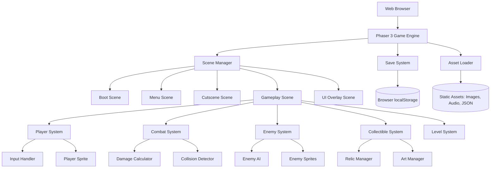

# Design Document: Seton Hall Quest

## Overview

Emily and the Ghost of Elizabeth Ann Seton is a browser-based 2D action-adventure game built with JavaScript and HTML5 Canvas, utilizing the Phaser 3 framework for game engine functionality. The game follows Emily, the gallery director, through four levels on Seton Hall University grounds as she completes a quest from Saint Elizabeth Ann Seton's ghost. Emily attacks by throwing low-quality artworks, and some enemies also attack by throwing artwork projectiles.

The architecture emphasizes client-side execution with no backend dependencies. All game logic, rendering, and state management occur in the browser. The game uses localStorage for save/load functionality and loads static assets (sprites, audio, level data) via HTTP.

The design prioritizes:
- Simple, accessible gameplay with easy difficulty
- Progressive difficulty: Levels 1-3 are short (30s-1min), Level 4 is longer and more challenging
- Colorful, dynamic visuals with smooth animations
- Satirical narrative elements (particularly corrupt priest dialogue and Saint Elizabeth Ann Seton complaining about bad priest portraits)
- Educational historical content integration (Seton Hall founded 1856, Saint Elizabeth Ann Seton canonized 1975, her miracles)
- Casual play sessions with save/resume capability
- Projectile-based combat using thrown low-quality artworks

## Architecture

### High-Level Architecture



### System Components

**Phaser 3 Game Engine**: Provides core game loop, rendering pipeline, physics, input handling, and scene management. Chosen for its mature ecosystem, excellent documentation, and suitability for 2D browser games.

**Scene Manager**: Orchestrates transitions between game states (boot, menu, cutscenes, gameplay, game over). Each scene is a self-contained Phaser Scene with its own lifecycle.

**Player System**: Manages player character state (position, health, inventory), processes input, and updates sprite animations.

**Combat System**: Handles collision detection between attacks and entities, calculates damage, applies status effects (invulnerability), and manages combat feedback (visual effects, sounds).

**Enemy System**: Controls enemy AI behavior (patrol, chase, attack), manages enemy spawning/despawning, and handles enemy-specific dialogue.

**Collectible System**: Manages relic and artwork placement, collection logic, and power activation.

**Level System**: Loads level layouts from JSON data, manages tilemap rendering, and handles level-specific logic (spawn points, triggers).

**Save System**: Serializes/deserializes game state to/from localStorage, handles save/load UI, and manages error cases.

**Asset Loader**: Preloads all game assets during boot scene, manages asset caching, and provides asset references to game systems.

### Technology Stack

- **Framework**: Phaser 3 (v3.60+)
- **Language**: JavaScript ES6+
- **Rendering**: HTML5 Canvas (2D context)
- **Audio**: Web Audio API (via Phaser)
- **Storage**: localStorage API
- **Build Tool**: None required (can use Vite for development server)
- **Deployment**: Static file hosting (GitHub Pages, Netlify, etc.)

## Components and Interfaces

### Core Game Components

#### GameConfig

```javascript
const gameConfig = {
  type: Phaser.AUTO,
  width: 1280,
  height: 720,
  physics: {
    default: 'arcade',
    arcade: {
      gravity: { y: 0 },
      debug: false
    }
  },
  scene: [BootScene, TitleScene, MenuScene, CampusMapScene, CutsceneScene, GameplayScene, UIScene, GameOverScene],
  audio: {
    disableWebAudio: false
  }
};
```

#### Player Component

```javascript
class Player {
  constructor(scene, x, y) {
    this.scene = scene;
    this.sprite = scene.physics.add.sprite(x, y, 'emily');
    this.health = 100;
    this.maxHealth = 100;
    this.speed = 200;
    this.attackDamage = 10;
    this.projectileSpeed = 300;
    this.inventory = {
      relics: [],
      artworks: []
    };
    this.isInvulnerable = false;
    this.invulnerabilityTimer = null;
    this.facingDirection = 'right'; // Track which way Emily is facing
  }
  
  update(cursors) {
    // Movement logic
    // Animation updates
    // Update facingDirection based on movement
  }
  
  throwArtwork() {
    // Create artwork projectile
    const projectile = this.scene.physics.add.sprite(
      this.sprite.x,
      this.sprite.y,
      'bad_artwork_projectile'
    );
    
    // Set velocity based on facing direction
    if (this.facingDirection === 'right') {
      projectile.setVelocityX(this.projectileSpeed);
    } else if (this.facingDirection === 'left') {
      projectile.setVelocityX(-this.projectileSpeed);
    } else if (this.facingDirection === 'up') {
      projectile.setVelocityY(-this.projectileSpeed);
    } else if (this.facingDirection === 'down') {
      projectile.setVelocityY(this.projectileSpeed);
    }
    
    projectile.damage = this.attackDamage;
    return projectile;
  }
  
  takeDamage(amount) {
    if (this.isInvulnerable) return;
    this.health -= amount;
    if (this.health <= 0) {
      this.die();
    }
  }
  
  activateRelic(relicType) {
    // Activate relic power
  }
  
  collectArtwork(artwork) {
    this.inventory.artworks.push(artwork);
  }
}
```

#### Enemy Component

```javascript
class Enemy {
  constructor(scene, x, y, type) {
    this.scene = scene;
    this.sprite = scene.physics.add.sprite(x, y, `enemy_${type}`);
    this.type = type; // 'corrupt_priest', 'lazy_student', 'clueless_admin'
    this.health = this.getHealthForType(type);
    this.damage = this.getDamageForType(type);
    this.speed = this.getSpeedForType(type);
    this.state = 'patrol'; // 'patrol', 'chase', 'attack'
    this.dialogue = this.getDialogueForType(type);
    this.canThrowArtwork = (type === 'corrupt_priest' || type === 'clueless_admin');
    this.projectileSpeed = 250;
    this.attackCooldown = 0;
  }
  
  update(player) {
    // AI behavior based on state
    // Update animations
    // Handle attack cooldown
    if (this.attackCooldown > 0) {
      this.attackCooldown -= this.scene.game.loop.delta;
    }
  }
  
  takeDamage(amount) {
    this.health -= amount;
    if (this.health <= 0) {
      this.die();
    }
  }
  
  attack(player) {
    if (this.canThrowArtwork && this.attackCooldown <= 0) {
      this.throwArtwork(player);
      this.attackCooldown = 2000; // 2 second cooldown
    } else if (!this.canThrowArtwork) {
      // Lazy students use melee attacks
      player.takeDamage(this.damage);
    }
  }
  
  throwArtwork(player) {
    const projectile = this.scene.physics.add.sprite(
      this.sprite.x,
      this.sprite.y,
      'bad_artwork_projectile'
    );
    
    // Aim toward player
    const angle = Phaser.Math.Angle.Between(
      this.sprite.x, this.sprite.y,
      player.sprite.x, player.sprite.y
    );
    
    projectile.setVelocity(
      Math.cos(angle) * this.projectileSpeed,
      Math.sin(angle) * this.projectileSpeed
    );
    
    projectile.damage = this.damage;
    return projectile;
  }
  
  showDialogue() {
    // Display satirical dialogue (especially for corrupt priests)
  }
}
```

#### Boss Component

```javascript
class Boss extends Enemy {
  constructor(scene, x, y, bossType) {
    super(scene, x, y, bossType);
    this.health = 200; // Higher health
    this.attackPatterns = this.getAttackPatterns(bossType);
    this.currentPhase = 1;
  }
  
  update(player) {
    // More complex AI with attack patterns
    // Phase transitions based on health
  }
  
  executeAttackPattern() {
    // Complex attack sequences
  }
}
```

#### Relic System

```javascript
class RelicManager {
  constructor(scene) {
    this.scene = scene;
    this.relicTypes = {
      hair: {
        name: "Hair of Saint Elizabeth Ann Seton",
        power: "invulnerability",
        duration: 10000 // 10 seconds
      },
      fingerBone: {
        name: "Finger Bone of Saint Elizabeth Ann Seton",
        power: "aoe_spell",
        radius: 150 // 5 meters in pixels (30px per meter)
      }
    };
  }
  
  activateInvulnerability(player) {
    player.isInvulnerable = true;
    player.sprite.setTint(0xffff00); // Visual feedback
    
    setTimeout(() => {
      player.isInvulnerable = false;
      player.sprite.clearTint();
    }, this.relicTypes.hair.duration);
  }
  
  activateAOESpell(player, enemies) {
    const aoeRadius = this.relicTypes.fingerBone.radius;
    enemies.forEach(enemy => {
      const distance = Phaser.Math.Distance.Between(
        player.sprite.x, player.sprite.y,
        enemy.sprite.x, enemy.sprite.y
      );
      if (distance <= aoeRadius) {
        enemy.takeDamage(30);
      }
    });
    // Visual effect for AOE
  }
}
```

#### Combat System

```javascript
class CombatSystem {
  constructor(scene) {
    this.scene = scene;
    this.playerProjectiles = scene.physics.add.group();
    this.enemyProjectiles = scene.physics.add.group();
  }
  
  createPlayerProjectile(player) {
    const projectile = player.throwArtwork();
    this.playerProjectiles.add(projectile);
    
    // Remove projectile after it goes off screen or after timeout
    this.scene.time.delayedCall(3000, () => {
      if (projectile.active) {
        projectile.destroy();
      }
    });
    
    return projectile;
  }
  
  createEnemyProjectile(enemy, player) {
    const projectile = enemy.throwArtwork(player);
    this.enemyProjectiles.add(projectile);
    
    // Remove projectile after timeout
    this.scene.time.delayedCall(3000, () => {
      if (projectile.active) {
        projectile.destroy();
      }
    });
    
    return projectile;
  }
  
  checkCollisions(player, enemies) {
    // Check player projectiles vs enemies
    this.playerProjectiles.children.entries.forEach(projectile => {
      if (!projectile.active) return;
      
      enemies.forEach(enemy => {
        if (this.scene.physics.overlap(projectile, enemy.sprite)) {
          enemy.takeDamage(projectile.damage);
          projectile.destroy();
        }
      });
    });
    
    // Check enemy projectiles vs player
    this.enemyProjectiles.children.entries.forEach(projectile => {
      if (!projectile.active) return;
      
      if (this.scene.physics.overlap(projectile, player.sprite)) {
        player.takeDamage(projectile.damage);
        projectile.destroy();
      }
    });
    
    // Check melee range for lazy students
    enemies.forEach(enemy => {
      if (!enemy.canThrowArtwork && enemy.state === 'attack') {
        if (this.scene.physics.overlap(player.sprite, enemy.sprite)) {
          enemy.attack(player);
        }
      }
    });
  }
}
```

#### Save System

```javascript
class SaveSystem {
  saveGame(gameState) {
    const saveData = {
      timestamp: Date.now(),
      player: {
        x: gameState.player.sprite.x,
        y: gameState.player.sprite.y,
        health: gameState.player.health,
        inventory: gameState.player.inventory
      },
      level: gameState.currentLevel,
      artCollection: gameState.artCollection,
      score: gameState.score
    };
    
    try {
      localStorage.setItem('setonHallQuest_save', JSON.stringify(saveData));
      return { success: true };
    } catch (e) {
      return { success: false, error: e.message };
    }
  }
  
  loadGame() {
    try {
      const saveData = localStorage.getItem('setonHallQuest_save');
      if (!saveData) {
        return { success: false, error: 'No save data found' };
      }
      return { success: true, data: JSON.parse(saveData) };
    } catch (e) {
      return { success: false, error: e.message };
    }
  }
}
```

#### Campus Map Component

```javascript
class CampusMapScene extends Phaser.Scene {
  constructor() {
    super({ key: 'CampusMapScene' });
  }
  
  init(data) {
    this.targetLevel = data.level; // 1, 2, or 3
    this.levelName = this.getLevelName(data.level);
  }
  
  create() {
    // Display simplified campus map background
    this.add.image(640, 360, 'campus_map_background');
    
    // Define landmark positions on the map
    const landmarks = {
      parkingLot: { x: 350, y: 500, label: 'Parking Lot' },
      walshLibrary: { x: 500, y: 300, label: 'Walsh Library\n(with Gallery & Rotunda)' },
      chapel: { x: 700, y: 250, label: 'Immaculate\nConception Chapel' },
      bolandHall: { x: 400, y: 450, label: 'Boland Hall' },
      theGreen: { x: 600, y: 400, label: 'The Green' },
      adminBuilding: { x: 750, y: 350, label: 'Administration\nBuilding' }
    };
    
    // Draw landmarks
    Object.entries(landmarks).forEach(([key, landmark]) => {
      this.add.circle(landmark.x, landmark.y, 8, 0x666666);
      this.add.text(landmark.x, landmark.y + 15, landmark.label, {
        fontSize: '12px',
        fill: '#333',
        align: 'center'
      }).setOrigin(0.5);
    });
    
    // Highlight current level location
    const levelLocations = {
      1: landmarks.parkingLot,      // Parking Lot
      2: landmarks.walshLibrary,    // Walsh Gallery (inside library)
      3: landmarks.walshLibrary,    // Walsh Library
      4: landmarks.adminBuilding    // Administration Building
    };
    
    const currentLocation = levelLocations[this.targetLevel];
    
    // Glowing highlight effect
    const highlight = this.add.circle(
      currentLocation.x,
      currentLocation.y,
      30,
      0xffff00,
      0.3
    );
    
    // Pulsing animation
    this.tweens.add({
      targets: highlight,
      alpha: 0.6,
      scale: 1.2,
      duration: 1000,
      yoyo: true,
      repeat: -1
    });
    
    // Display level name
    this.add.text(640, 100, `Next Location: ${this.levelName}`, {
      fontSize: '32px',
      fill: '#fff',
      backgroundColor: '#000',
      padding: { x: 20, y: 10 }
    }).setOrigin(0.5);
    
    // Continue prompt
    this.add.text(640, 650, 'Press SPACE to continue', {
      fontSize: '18px',
      fill: '#fff'
    }).setOrigin(0.5);
    
    // Input handling
    this.input.keyboard.once('keydown-SPACE', () => {
      this.scene.start('GameplayScene', { level: this.targetLevel });
    });
  }
  
  getLevelName(level) {
    const names = {
      1: 'Parking Lot',
      2: 'Walsh Gallery',
      3: 'Walsh Library',
      4: 'Administration Building'
    };
    return names[level] || 'Unknown';
  }
}
```

### Scene Structure

#### BootScene
- Loads all assets (sprites, audio, level data, campus map)
- Displays loading progress bar
- Transitions to TitleScene when complete

#### TitleScene
- Displays colorful retro-styled title screen
- Shows game name "Emily and the Ghost of Elizabeth Ann Seton"
- Plays simple retro background music
- Shows "Press SPACE to Start" prompt
- Transitions to MenuScene on space key press

#### MenuScene
- Main menu UI (New Game, Load Game, Options)
- Audio volume controls
- Transitions to CutsceneScene or GameplayScene

#### CampusMapScene
- Displays simplified map of Seton Hall University campus
- Highlights current level location with visual indicator
- Shows level name (Walsh Gallery, Walsh Library, or Administration Building)
- Shows key landmarks: Walsh Library Rotunda, Immaculate Conception Chapel, Boland Hall, the Green
- Advances to gameplay on player input

#### CutsceneScene
- Displays dialogue between Emily and Saint Elizabeth Ann Seton's ghost
- Shows historical content
- Advances on player input
- Transitions to CampusMapScene or GameplayScene

#### GameplayScene
- Main game loop
- Manages player, enemies, collectibles
- Handles combat
- Triggers cutscenes and level transitions

#### UIScene
- Runs parallel to GameplayScene
- Displays HUD (health, inventory, score, level name)
- Updates in real-time based on game state

#### GameOverScene
- Displays game over message
- Shows final score and art collection
- Restart or return to menu options

## Data Models

### Game State

```javascript
{
  currentLevel: 1, // 1 = Parking Lot, 2 = Walsh Gallery, 3 = Walsh Library, 4 = Administration Building
  player: {
    x: 640,
    y: 360,
    health: 100,
    maxHealth: 100,
    facingDirection: 'right',
    inventory: {
      relics: [
        { type: 'hair', quantity: 2 },
        { type: 'fingerBone', quantity: 1 }
      ],
      artworks: [
        { id: 'painting_01', name: 'Portrait of Saint Elizabeth', points: 100 }
      ]
    }
  },
  artCollection: {
    collected: ['painting_01'],
    totalPoints: 100
  },
  levelProgress: {
    level1Complete: false,
    level2Complete: false,
    level3Complete: false,
    level4Complete: false,
    bossesDefeated: []
  },
  settings: {
    musicVolume: 0.7,
    sfxVolume: 0.8
  }
}
```

### Level Data

```javascript
{
  id: 'parking_lot',
  name: 'Parking Lot',
  tilemap: 'parking_lot_tilemap',
  backgroundMusic: 'parking_theme',
  playerSpawn: { x: 100, y: 360 },
  duration: 'short', // 30s-1min gameplay
  enemies: [
    { type: 'lazy_student', x: 300, y: 300, patrol: [[300, 300], [400, 300]] },
    { type: 'clueless_admin', x: 500, y: 400, patrol: [[500, 400], [600, 400]] }
  ],
  boss: null, // No boss in level 1
  collectibles: {
    relics: [
      { type: 'hair', x: 350, y: 250 }
    ],
    artworks: [
      { id: 'painting_01', x: 450, y: 350, points: 50 }
    ]
  },
  cutsceneTriggers: [],
  historicalContent: {
    description: "The parking lot at Seton Hall University, where students and faculty begin their journey on the 58-acre South Orange campus.",
    facts: [
      "Seton Hall University is located 14 miles from Manhattan",
      "The campus is in the Village of South Orange, New Jersey"
    ]
  }
}
```

Example for Walsh Gallery (Level 2):
```javascript
{
  id: 'walsh_gallery',
  name: 'Walsh Gallery',
  tilemap: 'walsh_gallery_tilemap',
  backgroundMusic: 'gallery_theme',
  playerSpawn: { x: 100, y: 360 },
  duration: 'short', // 30s-1min gameplay
  enemies: [
    { type: 'corrupt_priest', x: 400, y: 300, patrol: [[400, 300], [500, 300]] },
    { type: 'lazy_student', x: 600, y: 400, patrol: [[600, 400], [700, 400]] }
  ],
  boss: null, // No boss in level 2
  collectibles: {
    relics: [
      { type: 'fingerBone', x: 450, y: 250 }
    ],
    artworks: [
      { id: 'painting_02', x: 550, y: 350, points: 100 }
    ]
  },
  cutsceneTriggers: [
    { x: 400, type: 'dialogue', cutsceneId: 'gallery_complaint' }
  ],
  historicalContent: {
    description: "The Walsh Gallery, located on the first floor of Walsh Library, enhances the intellectual life of Seton Hall University through dynamic exhibitions.",
    facts: [
      "Walsh Library opened in 1994 as a 155,000-square-foot facility",
      "The library features an iconic domed Rotunda"
    ]
  }
}
```

### Enemy Data

```javascript
{
  corrupt_priest: {
    health: 30,
    damage: 8,
    speed: 80,
    attackRange: 300, // Range for throwing artworks
    detectionRange: 200,
    canThrowArtwork: true,
    dialogue: [
      "Come closer, my child... I have something special for you.",
      "Your donations are... very appreciated.",
      "The church needs your support... and your trust.",
      "Such a generous young person you are...",
      "Why don't you stay after and help me with... paperwork."
    ],
    sprite: 'enemy_priest',
    animations: ['priest_walk', 'priest_throw', 'priest_idle']
  },
  lazy_student: {
    health: 20,
    damage: 5,
    speed: 60,
    attackRange: 40, // Melee range
    detectionRange: 150,
    canThrowArtwork: false,
    dialogue: [
      "Can't you see I'm busy scrolling?",
      "This is, like, so much work...",
      "Do I really have to?",
      "I'll do it later... maybe.",
      "Whatever, I don't even care."
    ],
    sprite: 'enemy_student',
    animations: ['student_walk', 'student_attack', 'student_idle']
  },
  clueless_admin: {
    health: 25,
    damage: 6,
    speed: 70,
    attackRange: 300, // Range for throwing artworks
    detectionRange: 180,
    canThrowArtwork: true,
    dialogue: [
      "Have you filled out form 27B?",
      "That's not my department.",
      "You'll need to speak to someone else about that.",
      "I'm going to need you to submit that in triplicate.",
      "Our policy clearly states..."
    ],
    sprite: 'enemy_admin',
    animations: ['admin_walk', 'admin_throw', 'admin_idle']
  }
}
```

### Cutscene Data

```javascript
{
  id: 'opening',
  background: 'cutscene_ghost',
  dialogue: [
    {
      speaker: 'ghost',
      text: "Emily, I need your help. The university grounds are in peril.",
      historicalNote: "Saint Elizabeth Ann Seton (1774-1821) was the first American-born saint, canonized September 14, 1975."
    },
    {
      speaker: 'emily',
      text: "A ghost? This is... unexpected. What do you need?"
    },
    {
      speaker: 'ghost',
      text: "These halls are filled with corruption. And have you SEEN these portraits of priests everywhere? Absolutely dreadful quality!",
      historicalNote: "Elizabeth Ann Seton founded the Sisters of Charity in 1809 and established the first free Catholic school for girls in 1810."
    },
    {
      speaker: 'emily',
      text: "You're... complaining about the art quality?"
    },
    {
      speaker: 'ghost',
      text: "Among other things! Collect the sacred relics and restore order to these halls. And please, do something about those terrible portraits.",
      historicalNote: "Saint Elizabeth Ann Seton performed miracles, including the healing of Anne Theresa O'Neill from acute leukemia in 1952."
    },
    {
      speaker: 'emily',
      text: "I'll do my best, Saint Elizabeth."
    },
    {
      speaker: 'ghost',
      text: "Good. Start in the parking lot - there's trouble brewing even there. I'll guide you along the way.",
      historicalNote: "Seton Hall University was founded in 1856 by Bishop James Roosevelt Bayley and named after his aunt, Saint Elizabeth Ann Seton."
    }
  ],
  nextScene: 'gameplay',
  nextLevel: 1
}
```

## Correctness Properties


*A property is a characteristic or behavior that should hold true across all valid executions of a system—essentially, a formal statement about what the system should do. Properties serve as the bridge between human-readable specifications and machine-verifiable correctness guarantees.*

### Property 1: Movement Input Updates Position

*For any* player position and movement direction input, applying the movement should update the player's position in the corresponding direction by the appropriate distance based on speed and delta time.

**Validates: Requirements 1.1**

### Property 2: Attack Action Creates Hitbox

*For any* player state, executing an attack action should create an attack hitbox with correct damage value, position offset based on player direction, and limited duration.

**Validates: Requirements 1.2**

### Property 3: Interaction Triggers Within Range

*For any* interactable object and player position, pressing the interact key should trigger the interaction if and only if the player is within the interaction range of the object.

**Validates: Requirements 1.3**

### Property 4: Level Completion Unlocks Next Level

*For any* game state where level N objectives are complete (N = 1, 2, or 3), level N+1 should be unlocked and accessible.

**Validates: Requirements 3.2, 3.3, 3.4**

### Property 5: Level Entry Loads Data and Spawns Enemies

*For any* level (1-4), entering it should load the level's tilemap data and spawn all enemies defined in the level configuration at their specified positions.

**Validates: Requirements 3.5**

### Property 6: Short Level Duration Design

*For any* of levels 1, 2, or 3, the level design (enemy count, layout size, objectives) should support completion within 30 seconds to 1 minute of gameplay.

**Validates: Requirements 3.6**

### Property 6: Short Level Duration Design

*For any* of levels 1, 2, or 3, the level design (enemy count, layout size, objectives) should support completion within 30 seconds to 1 minute of gameplay.

**Validates: Requirements 3.6**

### Property 7: Damage Application

*For any* attack (player attacking enemy or enemy attacking player), the attack should calculate damage based on the attacker's damage value and apply it to the target's health, reducing health by the damage amount.

**Validates: Requirements 4.1, 4.2**

### Property 8: Entity Removal on Death

*For any* entity (enemy or boss), when its health reaches zero or below, the entity should be removed from the level and trigger appropriate consequences (enemy removal or boss defeat sequence with progression unlock).

**Validates: Requirements 4.3, 6.2, 6.4**

### Property 9: Collectible Addition to Inventory

*For any* collectible item (relic or artwork), when the player collects it, the item should be added to the appropriate collection (relic inventory or art collection) and the collectible should be removed from the level.

**Validates: Requirements 5.1, 8.1**

### Property 10: Invulnerability Prevents Damage

*For any* player state with active invulnerability power, enemy attacks should not reduce the player's health for the duration of the invulnerability period (10 seconds).

**Validates: Requirements 5.2**

### Property 10: AOE Spell Range-Based Damage

*For any* configuration of enemies and player position, activating an AOE spell should deal damage to all enemies within 5 meters (150 pixels) of the player and deal no damage to enemies outside this range.

**Validates: Requirements 5.3**

### Property 11: Power Expiration Restores Normal State

*For any* relic power activation (invulnerability or AOE), after the power duration expires or completes, normal gameplay mechanics should be restored (player can take damage again, visual effects removed).

**Validates: Requirements 5.4**

### Property 12: Boss Trigger Spawns Boss

*For any* boss encounter trigger point, when the player reaches or crosses the trigger position, the boss should spawn at the designated location and combat should initiate.

**Validates: Requirements 6.1**

### Property 13: Boss Health Exceeds Regular Enemies

*For any* boss enemy and regular enemy of the same base type, the boss should have strictly greater health than the regular enemy, and the boss should have multiple attack patterns while regular enemies have single attack patterns.

**Validates: Requirements 6.3**

### Property 14: Cutscene Trigger Pauses Gameplay

*For any* cutscene trigger point, when the player reaches the trigger, gameplay should pause (player and enemies stop moving/attacking) and the appropriate cutscene should display.

**Validates: Requirements 7.1**

### Property 15: Cutscene Advancement

*For any* cutscene dialogue segment that is not the final segment, pressing the continue key should advance to the next dialogue segment in sequence.

**Validates: Requirements 7.3**

### Property 16: Cutscene Completion Resumes Gameplay

*For any* cutscene, when the final dialogue segment is completed, gameplay should resume (player and enemies can move/attack again) and the game should transition to the next scene or level as specified.

**Validates: Requirements 7.4**

### Property 17: Artwork Collection Awards Points

*For any* artwork with a point value, when it is added to the art collection, the player's total score should increase by exactly the artwork's point value.

**Validates: Requirements 8.2**

### Property 18: Save and Load Round Trip

*For any* game state, saving the game to localStorage and then immediately loading it should restore all persisted fields (player position, health, inventory with relics and artworks, art collection, level progress) to their original values.

**Validates: Requirements 9.1, 9.2, 9.3**

### Property 19: Keyboard Input Handling

*For any* game control action (movement, attack, interact, menu navigation), there should be a corresponding keyboard input handler that triggers the action when the key is pressed.

**Validates: Requirements 10.4**

### Property 20: Historical Content Presence

*For any* game content element (cutscene, level data, collectible description), the data structure should contain a historical content field that is populated with information about Seton Hall University or Saint Elizabeth Ann Seton.

**Validates: Requirements 2.3, 3.4, 7.2, 7.5, 11.3**

### Property 21: UI State Display

*For any* game state, the UI should display all current values correctly: player health, relic inventory contents, art collection count, total points, and current level name.

**Validates: Requirements 8.3, 12.1, 12.2, 12.3, 12.4**

### Property 22: Visual Effects Triggering

*For any* game event that should have visual effects (combat actions, relic power activation, enemy defeat), the appropriate visual effect should be created and displayed when the event occurs.

**Validates: Requirements 13.3**

### Property 23: Unique Enemy Visuals

*For any* two different enemy types (corrupt priest, lazy student, clueless administrator) or boss variants, they should use distinct sprite assets with different visual identifiers.

**Validates: Requirements 13.4**

### Property 24: Game State Music Mapping

*For any* game state (menu, level 1, level 2, boss battle), the appropriate background music track should be playing, and transitioning to a different game state should change to the corresponding music track.

**Validates: Requirements 14.1**

### Property 25: Action Sound Effects

*For any* game action (player attack, player taking damage, player collecting items, enemy actions, enemy defeats, relic activation), the appropriate sound effect should be triggered when the action occurs.

**Validates: Requirements 14.2, 14.3, 14.4**

### Property 26: Volume Control Functionality

*For any* volume setting value (including mute/zero), adjusting the music or sound effects volume should result in audio playing at the specified volume level.

**Validates: Requirements 14.6**

### Property 27: Campus Map Display Before Level

*For any* level transition (entering level 1, 2, or 3), the game should display the campus map scene showing the Seton Hall University layout with the target level location highlighted and labeled before starting gameplay.

**Validates: Requirements 15.1, 15.2, 15.3**

### Property 28: Campus Map Landmark Presence

*For any* campus map display, the map should show key Seton Hall landmarks including Walsh Library with Rotunda, Immaculate Conception Chapel, Boland Hall, and the Green at their relative positions.

**Validates: Requirements 15.4, 15.5**

### Property 29: Campus Map Continuation

*For any* campus map scene, pressing the continue key should transition from the campus map to the corresponding level gameplay scene.

**Validates: Requirements 15.6**

## Error Handling

### Combat Errors

**Invalid Damage Values**: If damage calculation results in negative or NaN values, clamp to zero and log warning. Prevent health from going below zero or above max health.

**Missing Hitbox**: If attack action fails to create hitbox (e.g., due to animation state issues), log error and allow retry on next attack input.

**Collision Detection Failures**: If physics overlap detection fails, fall back to distance-based collision check using Phaser.Math.Distance.

### Save/Load Errors

**localStorage Unavailable**: If localStorage is not supported or disabled, display error message: "Save functionality requires localStorage. Please enable it in your browser settings." Disable save/load buttons.

**Quota Exceeded**: If localStorage quota is exceeded during save, display error: "Unable to save game. Storage quota exceeded." Suggest clearing old saves.

**Corrupted Save Data**: If JSON.parse fails during load, display error: "Save data is corrupted. Starting new game." Clear corrupted save from localStorage.

**Missing Save Data**: If no save exists when load is selected, display error: "No saved game found. Please start a new game."

### Asset Loading Errors

**Failed Asset Load**: If any asset fails to load during boot scene, retry up to 3 times. If still failing, display error message with asset name and continue with placeholder assets where possible.

**Missing Audio**: If audio files fail to load, continue game without audio and display warning: "Audio unavailable. Game will run without sound."

### Level Data Errors

**Invalid Level Configuration**: If level JSON is malformed or missing required fields, log error with details and fall back to default level configuration.

**Missing Enemy Data**: If enemy type referenced in level doesn't exist in enemy data, log warning and skip spawning that enemy.

### Input Errors

**Conflicting Input**: If multiple movement keys are pressed simultaneously, prioritize most recent input. If opposite directions pressed, cancel movement.

**Rapid Input Spam**: Implement cooldown on attack action (200ms) to prevent hitbox spam from rapid key presses.

### State Management Errors

**Invalid State Transition**: If game attempts invalid scene transition (e.g., to non-existent scene), log error and remain in current scene.

**Null Reference**: If player or enemy object is null when accessed, log error and skip that frame's update for that entity. Attempt to respawn on next level load.

## Testing Strategy

### Dual Testing Approach

The testing strategy employs both unit testing and property-based testing to ensure comprehensive coverage:

**Unit Tests**: Focus on specific examples, edge cases, error conditions, and integration points between components. Unit tests verify concrete scenarios and boundary conditions.

**Property Tests**: Verify universal properties across all inputs using randomized test data. Property tests ensure correctness holds for the general case, not just specific examples.

Together, these approaches provide comprehensive coverage: unit tests catch concrete bugs and verify specific behaviors, while property tests verify general correctness across the input space.

### Property-Based Testing Configuration

**Library**: Use fast-check (https://github.com/dubzzz/fast-check) for JavaScript property-based testing.

**Test Configuration**:
- Minimum 100 iterations per property test (due to randomization)
- Each property test must reference its design document property using a comment tag
- Tag format: `// Feature: seton-hall-quest, Property {number}: {property_text}`

**Example Property Test Structure**:

```javascript
import fc from 'fast-check';

// Feature: seton-hall-quest, Property 1: Movement Input Updates Position
test('movement input updates position correctly', () => {
  fc.assert(
    fc.property(
      fc.record({
        x: fc.integer({ min: 0, max: 1280 }),
        y: fc.integer({ min: 0, max: 720 }),
        direction: fc.constantFrom('up', 'down', 'left', 'right'),
        speed: fc.integer({ min: 100, max: 300 }),
        deltaTime: fc.float({ min: 0.01, max: 0.1 })
      }),
      (input) => {
        const player = new Player(mockScene, input.x, input.y);
        player.speed = input.speed;
        const initialPos = { x: player.sprite.x, y: player.sprite.y };
        
        player.move(input.direction, input.deltaTime);
        
        const expectedDistance = input.speed * input.deltaTime;
        const actualDistance = Phaser.Math.Distance.Between(
          initialPos.x, initialPos.y,
          player.sprite.x, player.sprite.y
        );
        
        expect(actualDistance).toBeCloseTo(expectedDistance, 1);
        // Verify direction is correct
        if (input.direction === 'right') {
          expect(player.sprite.x).toBeGreaterThan(initialPos.x);
        }
        // ... similar checks for other directions
      }
    ),
    { numRuns: 100 }
  );
});
```

### Unit Testing Strategy

**Framework**: Use Jest for unit testing with jsdom for DOM/Canvas mocking.

**Test Categories**:

1. **Specific Examples**:
   - Opening cutscene displays correctly (Req 2.1)
   - Exactly two levels exist (Req 3.1)
   - Three enemy types exist (Req 4.5)
   - Two relic types exist (Req 5.5)
   - Game over screen displays when health reaches zero (Req 12.5)
   - Canvas renderer is used (Req 10.2)
   - Assets loaded via HTTP (Req 10.3)

2. **Edge Cases**:
   - Loading game with no save data shows error (Req 9.4)
   - Player at exact boundary of interaction range
   - Enemy at exact boundary of AOE range
   - Health exactly at zero
   - localStorage quota exceeded
   - Corrupted save data
   - Missing asset files

3. **Integration Tests**:
   - Complete level 1 flow (spawn → combat → boss → level complete)
   - Save during gameplay → reload → verify state restored
   - Cutscene → gameplay → cutscene transitions
   - Relic collection → activation → expiration flow
   - Art collection → score update → UI display

4. **Component Tests**:
   - Player component initialization and methods
   - Enemy AI state transitions (patrol → chase → attack)
   - Combat system collision detection
   - Save system serialization/deserialization
   - Asset loader error handling

### Test Data Generators for Property Tests

```javascript
// Arbitrary generators for fast-check
const arbPosition = fc.record({
  x: fc.integer({ min: 0, max: 1280 }),
  y: fc.integer({ min: 0, max: 720 })
});

const arbEnemyType = fc.constantFrom('corrupt_priest', 'lazy_student', 'clueless_admin');

const arbRelicType = fc.constantFrom('hair', 'fingerBone');

const arbGameState = fc.record({
  player: fc.record({
    x: fc.integer({ min: 0, max: 1280 }),
    y: fc.integer({ min: 0, max: 720 }),
    health: fc.integer({ min: 1, max: 100 }),
    inventory: fc.record({
      relics: fc.array(fc.record({
        type: arbRelicType,
        quantity: fc.integer({ min: 0, max: 10 })
      })),
      artworks: fc.array(fc.record({
        id: fc.string(),
        points: fc.integer({ min: 50, max: 200 })
      }))
    })
  }),
  currentLevel: fc.constantFrom(1, 2),
  artCollection: fc.record({
    collected: fc.array(fc.string()),
    totalPoints: fc.integer({ min: 0, max: 10000 })
  })
});
```

### Coverage Goals

- **Unit Test Coverage**: Minimum 80% code coverage for all game systems
- **Property Test Coverage**: All 26 correctness properties implemented as property tests
- **Integration Test Coverage**: All major game flows (level progression, save/load, combat, collection)
- **Error Handling Coverage**: All error conditions in Error Handling section tested

### Continuous Testing

- Run unit tests on every code change during development
- Run property tests before commits (may take longer due to 100+ iterations)
- Run full test suite (unit + property + integration) before releases
- Use GitHub Actions or similar CI for automated testing on pull requests

### Manual Testing Checklist

Some requirements cannot be fully automated and require manual verification:

- Visual quality and aesthetics (colorful, smooth animations)
- Audio quality and appropriateness
- Browser compatibility across Chrome, Firefox, Safari, Edge
- Performance (60 FPS) on target hardware
- Historical content accuracy (fact-checking against sources)
- Satirical dialogue tone and effectiveness
- Overall gameplay feel and difficulty balance
- Accessibility (keyboard controls, visual clarity)

